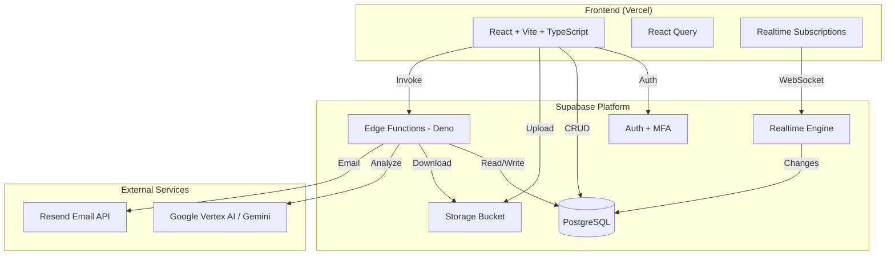
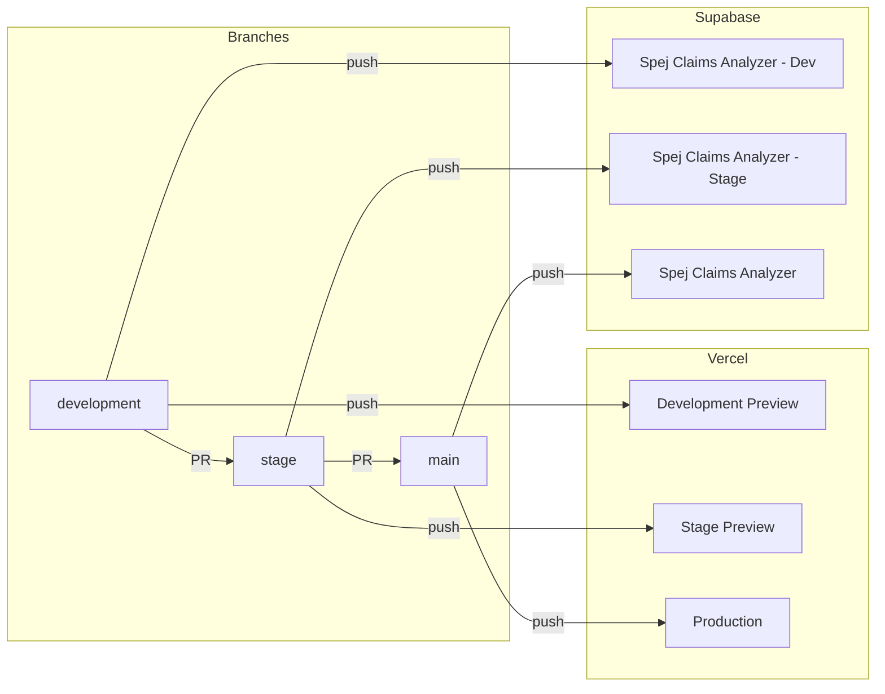
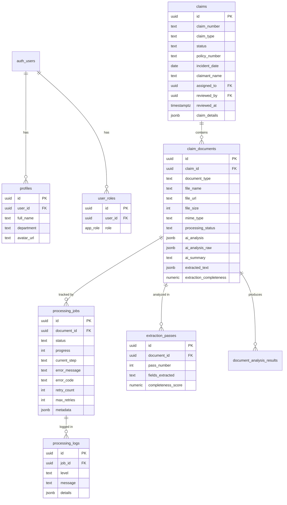
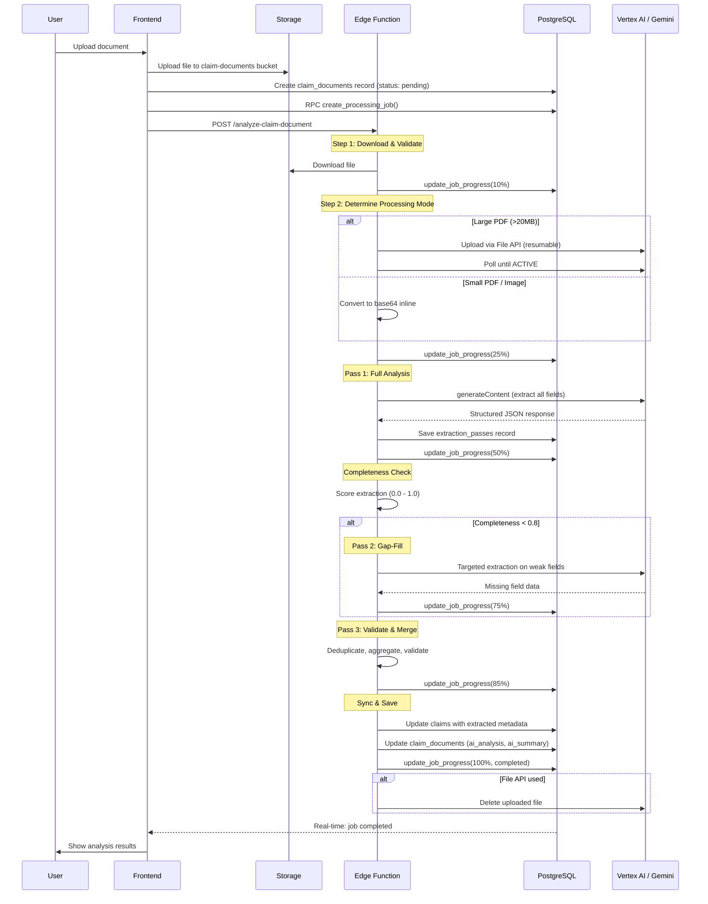
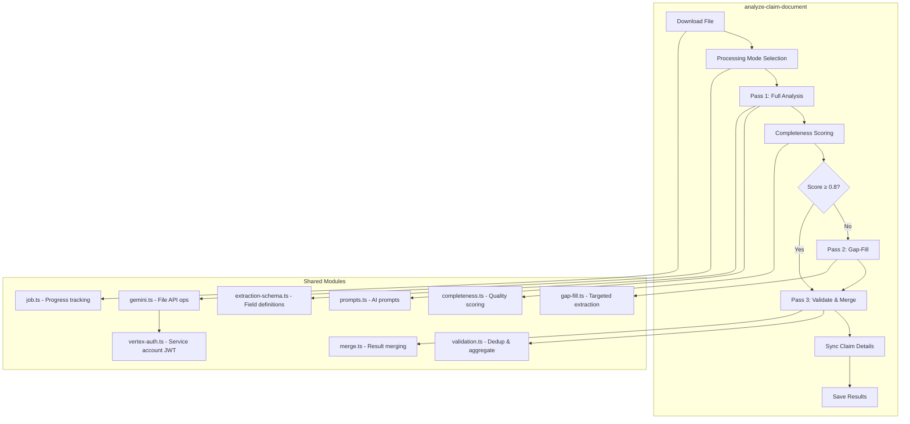
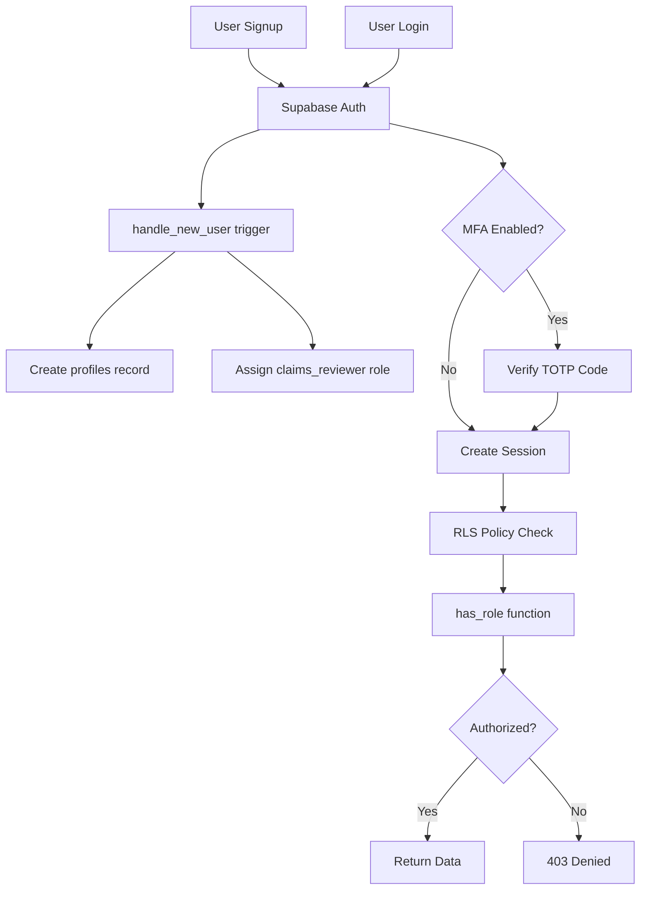
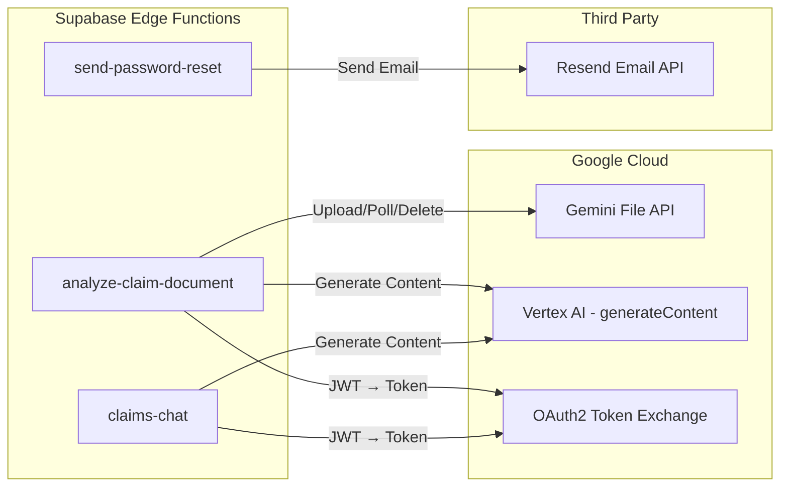

# Spej Claims Analyzer - System Architecture

## Overview

The Spej Claims Analyzer is an AI-powered insurance claims document review system. Adjusters upload claim documents (demand letters, medical records, bills), and the system uses Google Gemini to extract structured data, score completeness, and present findings for human review.



---

## Environments & CI/CD

Three environments with isolated Supabase projects and Vercel deployments:



| Branch | Vercel Env | Supabase Project | Deploy Trigger |
|--------|-----------|------------------|----------------|
| `development` | Development | Spej Claims Analyzer - Dev | Push to branch |
| `stage` | Preview | Spej Claims Analyzer - Stage | PR merge from development |
| `main` | Production | Spej Claims Analyzer | PR merge from stage |

Each deploy workflow runs: build + test + Vercel deploy + Supabase migrations + edge function deploy.

---

## Frontend Architecture

**Stack:** React 18 + TypeScript + Vite + Tailwind CSS + shadcn/ui

```mermaid
graph TD
    App[App.tsx - Router]
    App --> AuthPage[/auth - Login/Signup]
    App --> ResetPw[/reset-password]
    App --> Index[/ - Claims Workspace]
    App --> Admin[/admin - User Management]
    App --> Settings[/settings - MFA/Account]

    Index --> CA[ClaimsAgent]
    Index --> CDP[ClaimDetailsPanel]
    Index --> CQ[ClaimsQueue]

    CA -->|Upload & Chat| EF_Analyze[analyze-claim-document]
    CA -->|AI Chat| EF_Chat[claims-chat]
    CA -->|Status| Hook_PS[useProcessingStatus]

    Hook_PS -->|WebSocket| RT_Jobs[processing_jobs channel]
    Hook_PS -->|WebSocket| RT_Logs[processing_logs channel]
```

**Key Components:**

| Component | Purpose |
|-----------|---------|
| `ClaimsAgent` | Core UI — file upload, document analysis trigger, AI chat interface |
| `ClaimDetailsPanel` | Editable sidebar showing extracted claim metadata |
| `ClaimsQueue` | List of pending/completed claims for review and approval |
| `ProcessingStatusCard` | Real-time progress bar and log viewer during analysis |
| `DemandReviewCard` | Displays extracted analysis results after processing |

**State Management:**

| Layer | Tool | Purpose |
|-------|------|---------|
| Server state | React Query (TanStack) | Cache & sync Supabase data |
| Auth state | `useAuth` hook | Session tracking via Supabase Auth |
| Role state | `useUserRole` hook | RBAC checks (`isAdmin`, `canApproveReject`) |
| Processing state | `ProcessingContext` | Track multi-step document processing pipeline |
| Real-time | `useProcessingStatus` hook | WebSocket subscriptions for job progress |

---

## Database Schema



**Row-Level Security (RLS):**

All tables enforce RLS. Access is determined by the `has_role()` security definer function:

| Role | Claims | Documents | Jobs/Logs | Users |
|------|--------|-----------|-----------|-------|
| `admin` | All | All | All | Manage all |
| `claims_manager` | All | All | All | View only |
| `claims_reviewer` | Pending + assigned | Via claim access | Via document access | Own profile |

**Real-time Enabled Tables:** `claims`, `claim_documents`, `processing_jobs`, `processing_logs`

---

## Document Processing Pipeline

This is the core of the system — a multi-pass AI extraction pipeline with real-time progress tracking.



**Processing Modes:**

| Mode | Condition | Method |
|------|-----------|--------|
| `gemini-file` | PDF > `GEMINI_FILE_API_THRESHOLD` + Gemini key configured | Upload to Gemini Files API, reference by `fileData` URI |
| `pdf-inline` | PDF ≤ threshold | Base64 encode, send inline |
| `vision-url` | Image files | Fetch + send image bytes inline |
| `text-fallback` | No Gemini key + large file | Text-only extraction |

**File Size Thresholds:**

| Threshold | Value | Purpose |
|-----------|-------|---------|
| `GEMINI_FILE_API_THRESHOLD` | 20 MB | Switch to File API upload |
| `STREAMING_THRESHOLD` | 40 MB | Stream from storage instead of buffering |
| `GEMINI_PDF_INFERENCE_LIMIT` | 50 MB | Max size Gemini can process |
| `PRO_MODEL_THRESHOLD` | 50 MB | Use gemini-2.5-pro instead of flash |
| `MAX_FILE_SIZE` | 300 MB | Hard upload limit |

---

## Edge Functions



| Function | Purpose | Integrations |
|----------|---------|-------------|
| `analyze-claim-document` | Multi-pass document analysis pipeline | Vertex AI (Gemini 2.5), Supabase DB & Storage |
| `claims-chat` | Conversational AI assistant for claim review | Lovable AI API |
| `send-password-reset` | Email password reset links | Resend Email API |

---

## Authentication & Authorization



**Roles:**

| Role | Permissions |
|------|-------------|
| `admin` | Full access — all claims, documents, user management |
| `claims_manager` | View all claims, approve/reject, no user management |
| `claims_reviewer` | View pending/assigned claims, submit for review |

New users are automatically assigned `claims_reviewer`. Admins manage roles via the Admin page.

---

## External Integrations



| Service | Purpose | Auth Method |
|---------|---------|-------------|
| Google Gemini API (Gemini 2.5) | Document analysis, extraction, claims chat | API key (`GEMINI_API_KEY`, `x-goog-api-key`) |
| Gemini Files API | Large PDF upload/processing | API key (`GEMINI_API_KEY`) |
| Anthropic (Claude) | Pass 5 grounding / repair evaluation | API key (`ANTHROPIC_API_KEY`, `x-api-key`) |
| Resend | Password reset emails | API key (`RESEND_API_KEY`) |

---

## Storage

**Bucket:** `claim-documents` (Supabase Storage)

```
claim-documents/
  └── {uuid}/
      └── demand-letter.pdf
      └── medical-records.pdf
```

- Files uploaded from frontend with random UUID prefix
- Public read access for edge function processing
- File metadata stored in `claim_documents` table (`file_name`, `file_size`, `mime_type`, `file_url`)

---

## Environment Variables

### Frontend (Vercel)

| Variable | Purpose |
|----------|---------|
| `VITE_SUPABASE_PROJECT_ID` | Supabase project reference |
| `VITE_SUPABASE_URL` | Supabase API endpoint |
| `VITE_SUPABASE_PUBLISHABLE_KEY` | Supabase anon/public key |

### Edge Functions (Supabase Secrets)

| Variable | Purpose |
|----------|---------|
| `SUPABASE_URL` | Auto-provided by Supabase |
| `SUPABASE_SERVICE_ROLE_KEY` | Auto-provided by Supabase |
| `GEMINI_API_KEY` | Google Gemini API key (analysis, extraction, claims chat) |
| `ANTHROPIC_API_KEY` | Anthropic API key (Pass 5 grounding) |
| `RESEND_API_KEY` | Resend email service |
